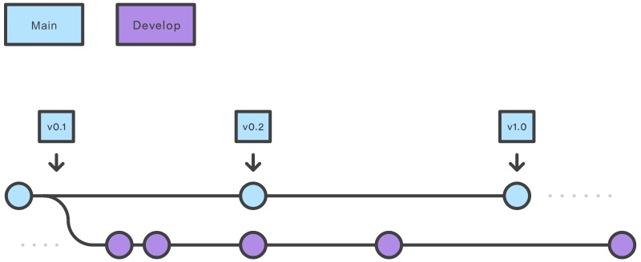
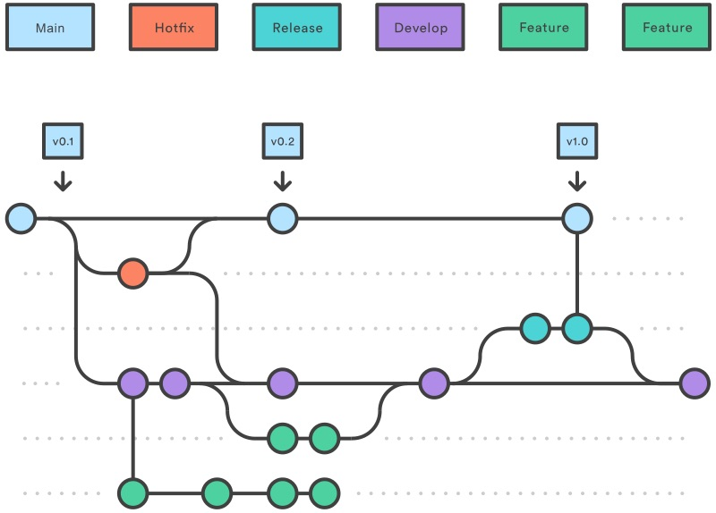

# Git Branching Strategy

This document describes the use of the [`Gitflow` workflow](https://www.gitkraken.com/learn/git/git-flow) as a Git branching strategy.

## Contents

* Overview
  * Primary branches
* Supporting branches
* Overall flow of Gitflow
* Credits

---

## Overview

Gitflow is a Git workflow that helps with continuous delivery and implementing DevOps practices.

### Primary Branches

It consists of 2 main (primary) branches, each of which exist indefinitely:

| Branch | Description |
| -------| ------------|
| `main` | * Contains production code * All development code will ultimately strive to be merged into `main` |
| `develop` | * Contains pre-production code * When a `feature` [branch] is finished, it is merged into `develop` |

## Supporting Branches

During the development cycle, a variety of supporting branches are used:

| Branch | Description | Naming Convention |
| -------| ------------| ------------|
| `feature_*` | * Used to develop new features for the upcoming releases * May branch off from `develop` and must merge into `develop` | `feature_<name_of_feature>` |
| `release_*` | * Support preparation of a new production release * They allow many minor bug to be fixed and preparation of metadata for a release * May branch off from `develop` and must merge into `main` and `develop` | `release_<name_of_release>` |
| `hotfix_*` | * hotfix branches are necessary to act immediately upon an undesired status of the `main` branch * May branch off from `main` and must merge into `main` and `develop` | `hotfix_<name_of_fix>` |

---

## Overall Flow of `Gitflow`

1. A `develop` branch is created from `main`
2. A `release` branch is created from `develop`
  * When a `release` branch is complete, it is merged into both `develop` and `main`
3. A `feature` branch is created from `develop`
  * When a `feature` is complete it is merged into the `develop` branch
4. A `hotfix` branch is created from `main` and is only created if an issue in `main` is detected
  * Once the `hotfix` is complete it is merged to both `develop` and `main`

## Credits

This `README` captures the main points from [Atlassian](https://www.atlassian.com/git/tutorials/comparing-workflows/gitflow-workflow) and [Gitkraken's](https://www.gitkraken.com/learn/git/git-flow) documentation.
